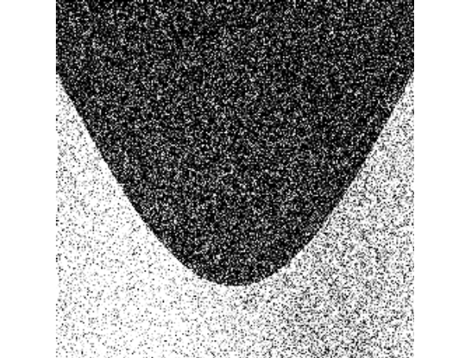
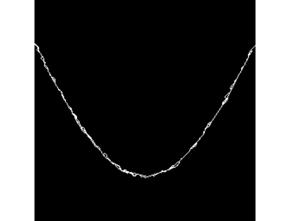
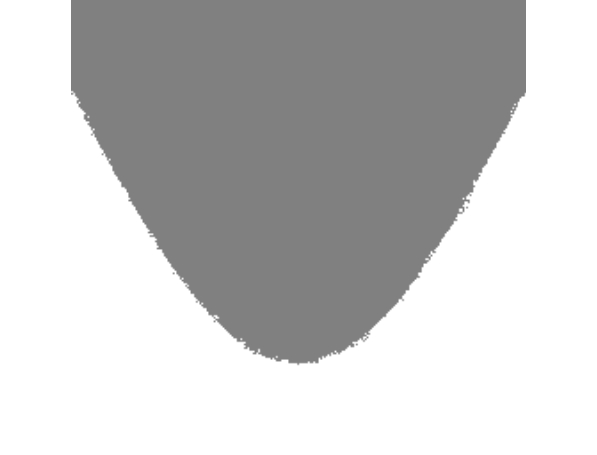
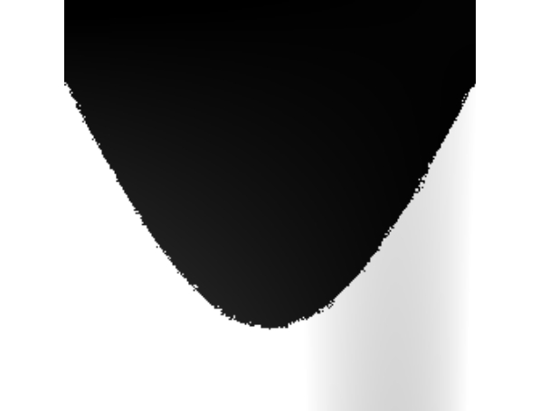
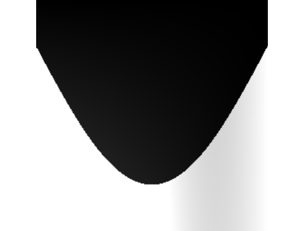
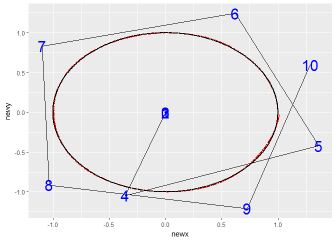
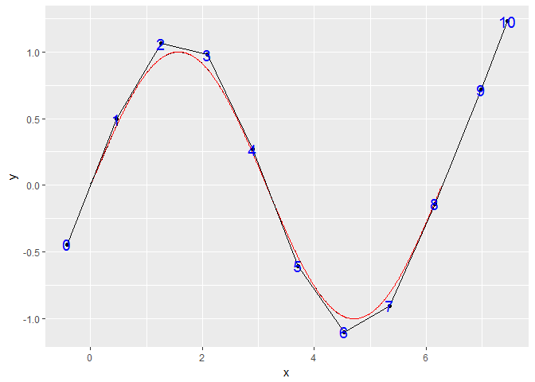
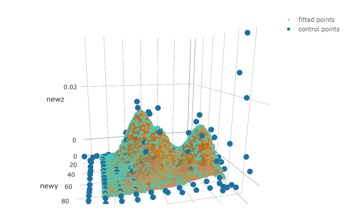
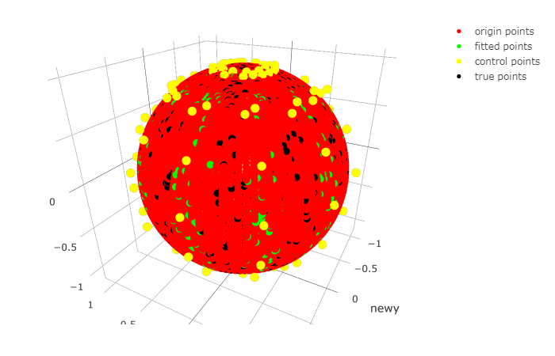

yangtiao
================
The package can be used to denoise image by block-B-spline.

Denoise Image:
------------------------------
when  get a noisy image:

Firstly, search jump points,and interpolate between the points:

Then, depend on the jump points, segment the image to make each block a continuous image:

Finally, The B-spline is used to fit the surface in each block:

The following image is the original image:

The R package also can be use to calculate the value of B-spline basis，and provide 2D(`sin(x)` and `circular`) and 3D(`two dimensional density surface` and `sphere`) examples in the `demo` .

Some examples' result diagram:
------------------------------

